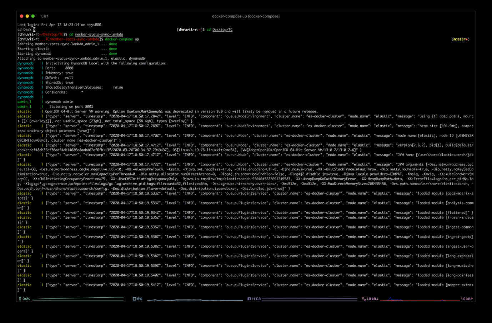
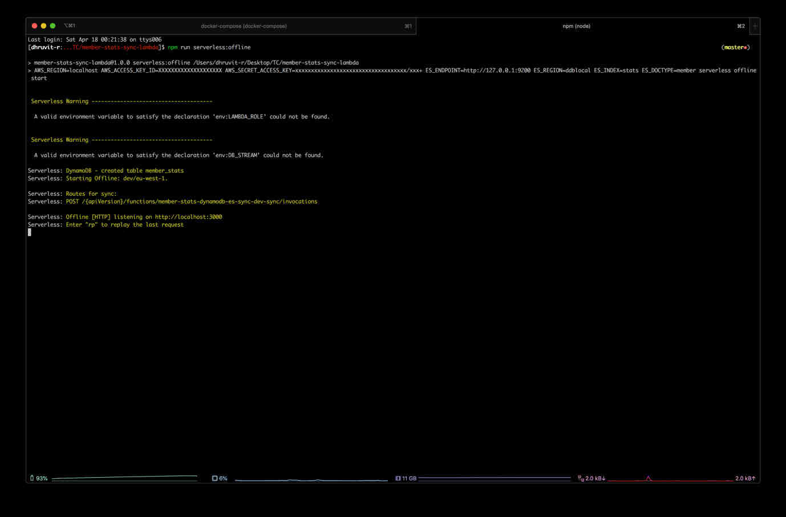
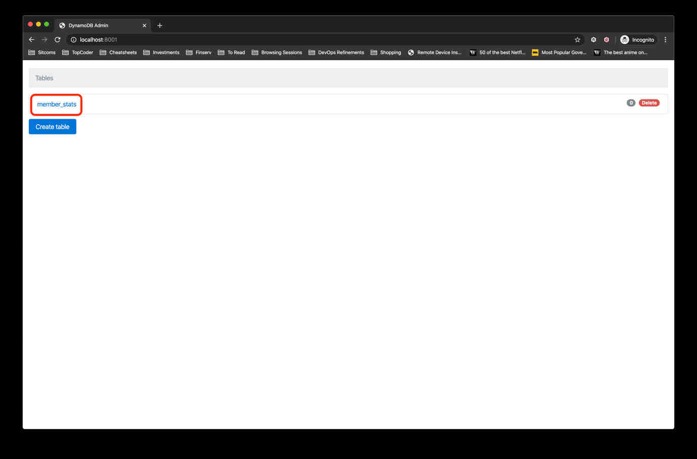
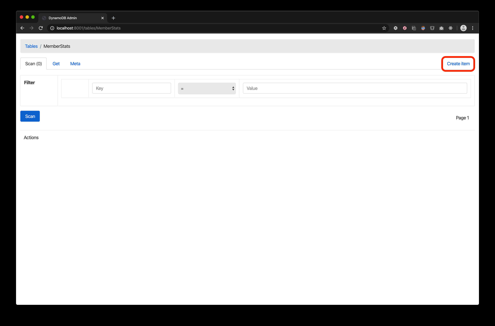
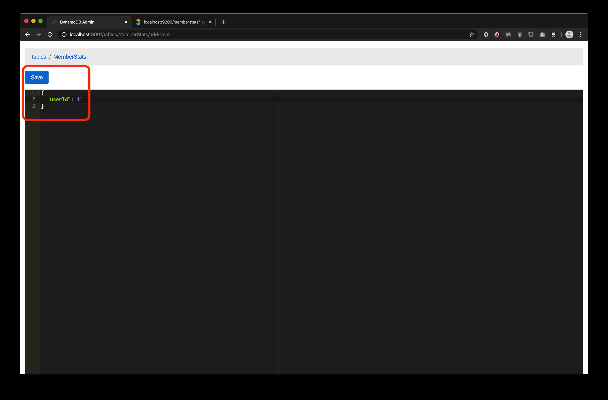

1.  Run `docker-compose up`

    

2.  Run `npm run serverless:offline`

	

3.  Go to [http://localhost:8001](http://localhost:8001), and click on the `MemberStats` table.

    

4.  Click on the `Create Item` button.

    

5.  Enter the following sample data into the content editor, and click on the `Save` button.

    

6.  Go to [http://localhost:9200/memberstats/_search?pretty](http://localhost:9200/memberstats/_search?pretty) to ensure that
    the data has been saved.

    