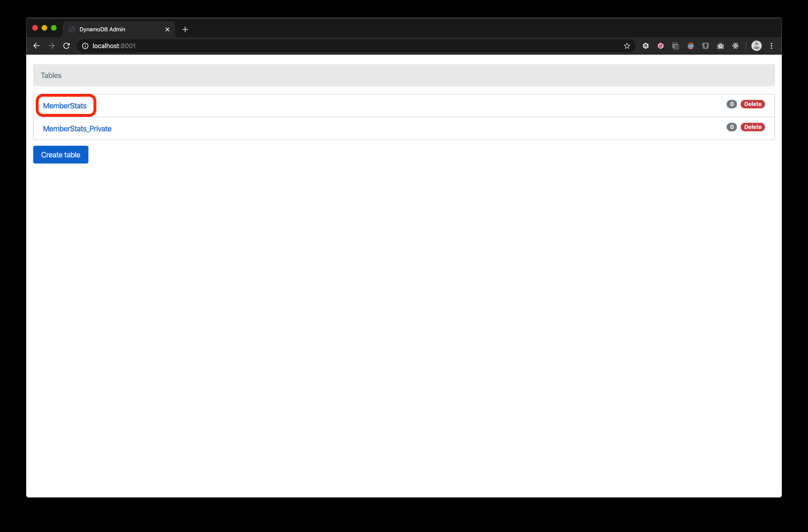
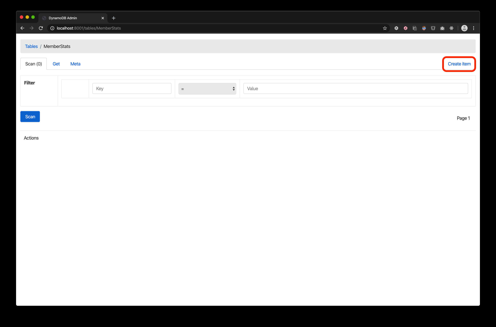
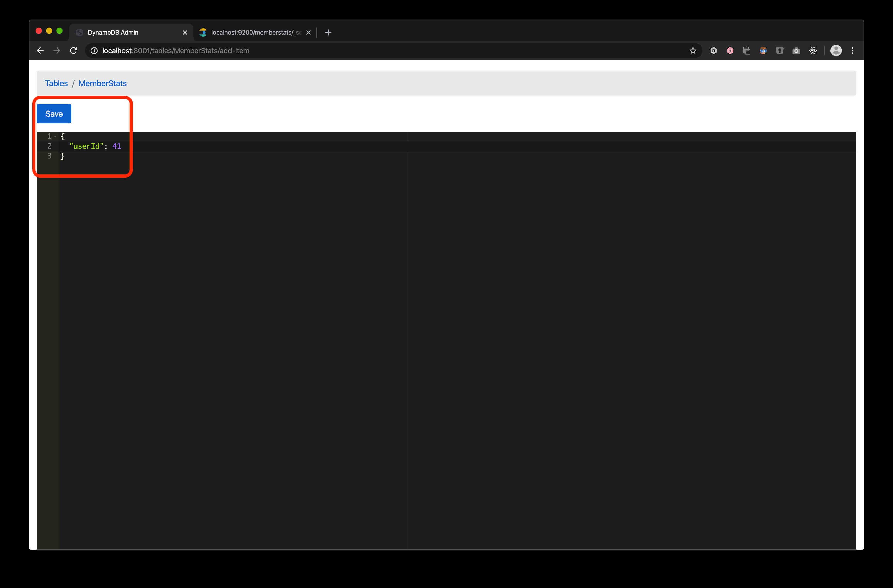

# member-stats-sync-lambda

## Prerequisites
1. Amazon DynamoDB table for the streaming and sending member stats data to Amazon Lambda exists and the ARN is known (please enable the streaming on DynamoDB with View type "New and old images" - see screen-shot in Verification Document if required).
2. Amazon ElasticSearch domain for posting the member stats data already exists and endpoint is known.
3. AWS Lambda IAM role that has the privilege (permission policies) to read the stream from DynamodDB already exists and ARN is known.
4. Amazon ElasticSearch domain access policy has been configured so that AWS Lambda IAM role can do necessary action to post data to ElasticSearch and for unit test purpose, either using IP address or Serverless Agent IAM User below is given access to post data to ElasticSearch.
5. Serverless Framework has been installed. If not yet done, please follow this [link](https://serverless.com/framework/docs/providers/aws/guide/installation/).
6. Serverless Agent IAM User has been configured properly and its access key ID and its agent secret access key is known, please follow this [link](https://serverless.com/framework/docs/providers/aws/guide/credentials/) to setup one if not yet done.
7. All the instructions below are using Node v10.x. 

The prerequisites above are part of this documentation, please contact author (Gungz) if there're questions.

## Environment Variables
Please follow this instruction to setup the required environment variables. We are using Linux terminal in this example.
```
export AWS_ACCESS_KEY_ID=<your serverless agent access key id>
export AWS_SECRET_ACCESS_KEY=<your serverless agent secret access key>
```
For the sake of unit testing to run, running your lambda function locally, and deploying your lambda's environment variables, please also setup 6 env variables below in your terminal (using export command as above).
1. ES_STATS_MAPPING   --> Your ElasticSearch document type
2. ES_ENDPOINT        --> Endpoint of your elastic search
3. ES_STATS_INDEX     --> ElasticSearch Index for your documents
4. ES_REGION          --> Region of your elastic search e.g. eu-west-1
5. DB_STREAM          --> ARN of your DynamoDB Table Stream (by setting this, the DynamoDB trigger in Lambda doesn't need to be configured manually)
6. LAMBDA_ROLE        --> ARN of IAM Role to be used when executing Lambda

## Change the serverless.yml to fit your environment
Please open serverless.yml from the project and modify following value in case you don't want to use environment variables:
1. role (under index.handleSync)    --> ARN of your AWS Lambda IAM Role 
2. arn (under stream)               --> ARN of your DynamoDB table stream
3. ES_* (under environment)         --> This is by default populated by environment variables, feel free to change if needed 
4. Please also modify stage and region to fit your needs

## Unit Test and run lambda locally
Open terminal and run `cd <your project directory>`
Run `npm test` to run the unit test
The test files can be found in test folder.

Run the following to invoke lambda locally.
```
serverless invoke local -f sync -p test_data/xxxxx.json`
```
Please note that even if the lambda is invoked locally using test data, the data is still being posted to ElasticSearch in AWS based on environment variables above. In order for the local invocation to work properly, the serverless agent that is used by serverless command has to have privilege to post the data to ElasticSearch or the access policy for the ElasticSearch is configured to allow any AWS principal to post the data but restricted by condition e.g. by using IpAddress.  

## Deploy
When all the things mentioned above have been done, please run the following:
```
cd <directory or folder of the project>
serverless deploy 
```
Feel free to use flag `--verbose` after `serverless deploy` if you want to know more information about your deployment. 

You can also modify the lambda code if required and the redeployment is as simple as running `serverless deploy` again.

## Local Develop

1. Update the serverless.yml file to for sections supporting local. looking for
```
#following are used for local env
```

2.  Setup Docker and Docker Compose locally, and run `docker-compose up`

    

3.  Run `npm run serverless:offline`

	

4.  Go to [http://localhost:8001](http://localhost:8001), and click on the `MemberStats` table.

    

5.  Click on the `Create Item` button.

    

6.  Enter the following sample data into the content editor, and click on the `Save` button.

    

7.  Go to [http://localhost:9200/memberstats/_search?pretty](http://localhost:9200/memberstats/_search?pretty) to ensure that
    the data has been saved.

    